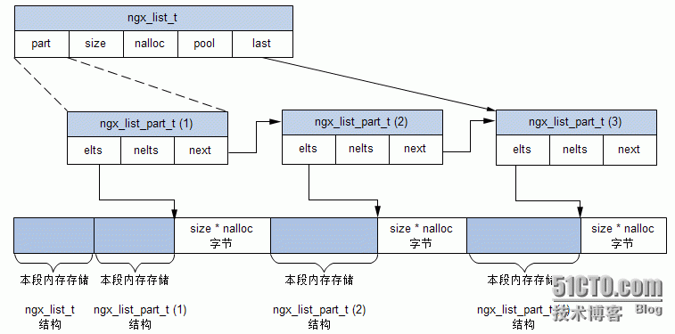

## ngx_list_t 结构

```C
typedef struct ngx_list_part_s  ngx_list_part_t; 
struct ngx_list_part_s {
    void             *elts;		// 指向数组的起始地址
    ngx_uint_t        nelts;	// 数组中已经使用了多少个元素
    ngx_list_part_t  *next;		// 指向下一个链表元素的地址
};


typedef struct {                 
    ngx_list_part_t  *last;		// 链表的首个数组元素
    ngx_list_part_t   part;		// 指向链表的最后一个数组元素
    size_t            size;		// 链表节点是一个数组，指明数组中每个元素大小
    ngx_uint_t        nalloc;	// 链表节点是一个数组，指明数组中元素个数
    ngx_pool_t       *pool;		// 链表中管理内存分配的内存池对象
} ngx_list_t;

```

## ngx_list_t 提供接口

```C
/*
 * @detail	创建一个新的链表
 * @param 	pool	内存池对象
 * @param	n		节点中容纳数组个数
 * @param	size	节点中数组元素大小
 * @return	成功返回新创建的链表地址，石板返回 NULL
 * */
ngx_list_t *ngx_list_create(ngx_pool_t *pool, ngx_uint_t n, size_t size);

// 初始化一个已有的链表
static ngx_inline ngx_int_t
ngx_list_init(ngx_list_t *list, ngx_pool_t *pool, ngx_uint_t n, size_t size);

/* 
 * @detail 	往链表中添加新元素，通常先获取该函数返回的地址，在对返回的地址进行赋值
 * @param 	list	需要插入的链表节点
 * @return	成功返回新分配的元素首地址，失败返回 NULL
 * */
void *ngx_list_push(ngx_list_t *list);
```


## ngx_list_t 内存分布

